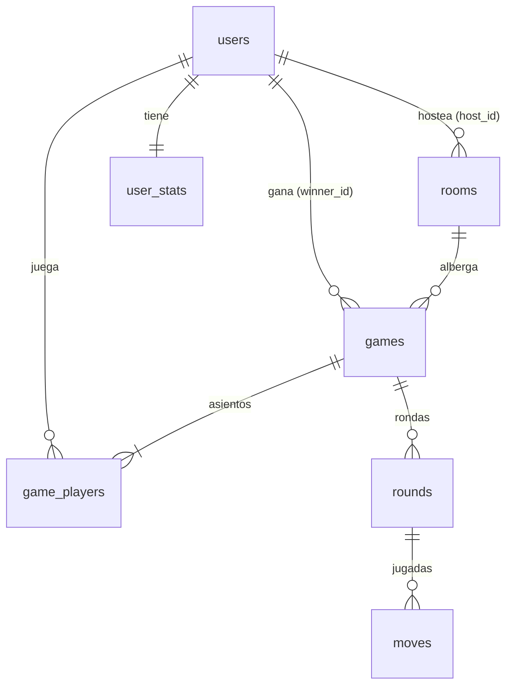

# Capicúa — Juego de Dominó (monorepo)

Fases 1-3 completadas: motor puro + modo contra la máquina + cuentas/ranking con PostgreSQL.

## Estructura

```
/packages/engine   -> motor puro (sin red ni BD), reutilizable en server y client
/server            -> Node + Express + Socket.IO (andamio) + IA + partidas solo
/client            -> React + Vite + Tailwind (mesa vs máquina)
/database          -> (Fase 3) schema.sql, seed.sql, migrate.js
```

## Requisitos

Node 20+.

## Ejecutar (dev)

```bash
npm install
npm test                          # motor: 28 tests
npm run test --workspace=@domino/server   # IA + auth + solo + stats: 19 tests (2 de integración requieren DATABASE_URL)
node database/validate.mjs        # valida schema + seed en memoria (pg-mem)

# Terminal 1: backend :3001
node server/src/index.js

# Terminal 2: frontend :5173
npm run dev --workspace=@domino/client
```

Abrir http://localhost:5173 → configurar bots/dificultad → Jugar.
El Vite proxy redirige `/api` y `/health` al backend :3001.
En la pantalla de inicio hay panel de cuenta (registro/login/invitado) + ranking.
Sin `DATABASE_URL` el modo vs máquina funciona igual; auth/ranking responden 503
con mensaje claro.

## API solo (Fase 2)

- `POST /api/solo {numBots 1-3, level easy|medium|hard, targetScore}` → estado público
- `GET /api/solo/:id` → estado público (mano del humano + conteos rivales, nunca manos ajenas)
- `POST /api/solo/:id/play {tile:{left,right}, side}` → juega el humano; el servidor encadena los bots
- `POST /api/solo/:id/draw` → el humano roba 1 del pozo (solo sin jugada; responde `{..., drew:{left,right}}`)
- `POST /api/solo/:id/pass` → el humano pasa (solo sin jugada y pozo vacío)
- `POST /api/solo/:id/next-round` → siguiente ronda (el estado incluye `lastMove`, `canDraw`, `canPass`)
- `GET /health` → `{ok:true, db}`

## API cuentas + ranking (Fase 3, requiere DATABASE_URL)
- `POST /api/auth/register {username, email, password}` → `{token, user}`
- `POST /api/auth/login {login, password}` → `{token, user}`
- `POST /api/auth/guest` → `{token, user}` invitada
- `GET /api/auth/me` (Bearer) → `{user}` con stats
- `GET /api/ranking?limit=50` → `{ranking}` (vista `v_ranking`)
- `GET /api/users/:id` → perfil público + stats (sin email)
- `GET /api/users/:id/games?limit=20` → historial de partidas

```bash
npm run db:migrate   # aplica database/schema.sql a DATABASE_URL
npm run db:seed      # carga usuarios/salas/partida demo (clave: demo1234)
```

## Jugar en línea (Fase 4, multijugador 2-4)

En la portada pulsa **🌐 Jugar en línea**. Funciona con cuenta o como
invitado anónimo (el socket te identifica por tu token si lo tienes).

- **Crear sala** (2-4 jugadores + meta) → comparte el **código de 6 letras**.
- **Unirse** con código, desde **🏠 Salas abiertas** o aceptando una **✉️ invitación**.
- **👥 Conectados** muestra quién está libre/en sala; dentro de tu sala puedes
  **invitar** a los libres.
- El anfitrión (👑) empieza la partida; mesa compartida en tiempo real
  (jugar/robar/pasar, última jugada resaltada, timer 30s con auto-jugada).
- Si alguien se desconecta a mitad de partida, su asiento se conserva para
  volver; a los 30s en su turno el servidor juega por él. Al terminar la
  partida el resultado se guarda en la BD (si hay `DATABASE_URL`).

Eventos Socket.IO: `room:create/join/leave/start/next`, `game:play/draw/pass`,
`invite:send`, servidor → `lobby:update`, `room:state` (vista personal),
`invite:received`.

## Base de datos — diagrama ER


`game_players.user_id` NULL = bot. `games.room_id` NULL = vs máquina. `games.winner_id` NULL = ganó un bot. Ranking = vista `v_ranking` (RANK por victorias y puntos).

## Base de datos — conectarse (DBeaver / pgAdmin)

Necesitas `DATABASE_URL`. Local: cópiala de `.env.example` a `.env` y ajusta
usuario/clave. Render: Dashboard → tu base PostgreSQL → *Connection info* → *External Database URL*.

**DBeaver** (recomendado): Nueva conexión → PostgreSQL → pega Host, Port, Database,
Username, Password de la URL. Si es Render, pestaña *SSL* → activar SSL (la URL ya
lleva `?sslmode=require`; el servidor usa `rejectUnauthorized:false`). Test Connection → Finish.

**pgAdmin**: Servers → Register → Server. Pestaña *Connection*: Host/Port/Maintenance DB/
Username/Password. Si es Render: pestaña *Parameters* o *SSL* → SSL mode = Require.

> Sin servidor local instalado: instala PostgreSQL (ej. EDB installer o `winget
> install PostgreSQL.16`), crea la BD `domino` y ejecuta `npm run db:migrate` (+ `db:seed` opcional).

## Base de datos — consultas útiles

```sql
-- Ranking global (top 20)
SELECT * FROM v_ranking LIMIT 20;

-- Historial de un jugador (ej. alba)
SELECT g.id, g.mode, g.started_at, g.ended_at,
       u.username AS ganador, gp.seat, gp.final_score
FROM games g
JOIN game_players gp ON gp.game_id = g.id
JOIN users u ON u.id = gp.user_id
LEFT JOIN users w ON w.id = g.winner_id
WHERE u.username = 'alba'
ORDER BY g.started_at DESC;

-- Partidas por sala
SELECT r.code, r.status, COUNT(g.id) AS partidas
FROM rooms r LEFT JOIN games g ON g.room_id = r.id
GROUP BY r.code, r.status ORDER BY r.code;

-- Detalle de una ronda (jugadas en orden)
SELECT m.move_number, m.seat, m.tile_left, m.tile_right, m.side
FROM moves m JOIN rounds r ON r.id = m.round_id
WHERE r.game_id = 1 AND r.round_number = 1
ORDER BY m.move_number;
```
